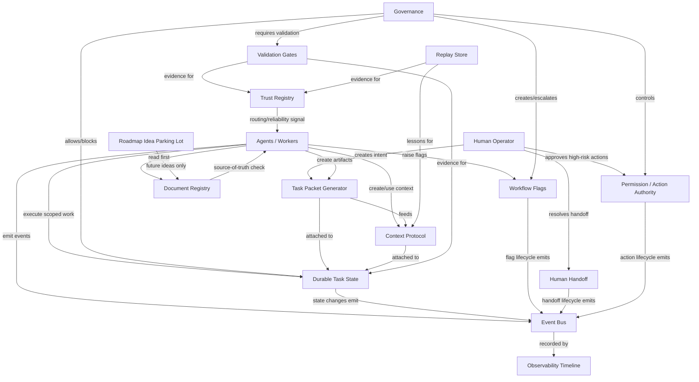
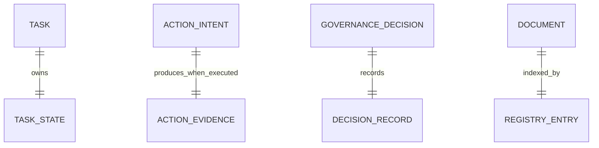
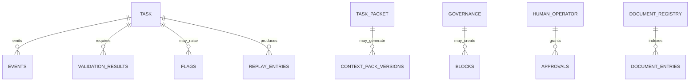
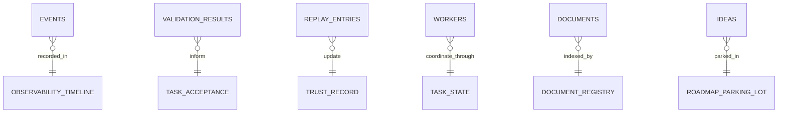
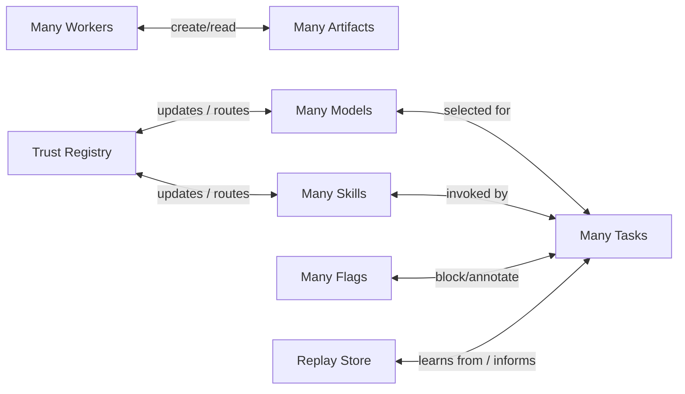
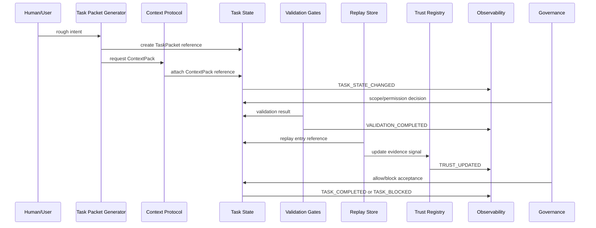
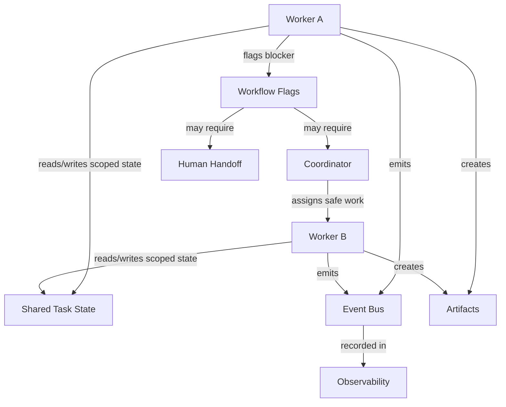
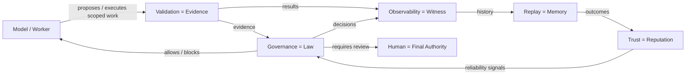
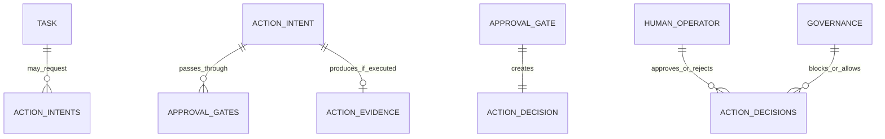
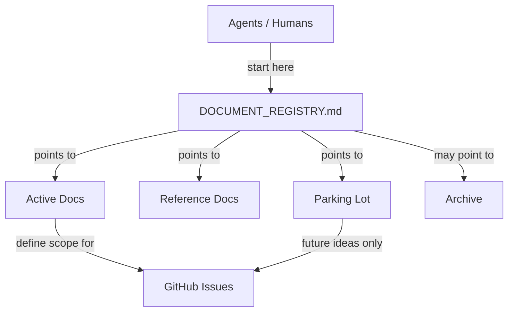

# OwnAI Architecture Relationship Diagrams

This document maps the major OwnAI systems and their relationship cardinalities.

It is intended as a high-level overview so agents and humans can understand how systems connect without loading every detailed document.

## Core Principle

```text
Understand the system graph before adding new nodes.
```

This supports:

```text
- anti-duplication
- source-of-truth discipline
- dependency-aware autonomy
- future parallel work
- safer worker coordination
```

---

# Relationship Legend

```text
1 → 1
one system owns or produces one primary related artifact

1 → N
one system produces or controls many related artifacts/workers/events

N → 1
many systems report into one shared system/source of truth

N ↔ N
many systems interact through structured records, events, or artifacts
```

---

# High-Level System Graph



---

# Core Cardinality Map

| Relationship | Cardinality | Meaning |
|---|---:|---|
| Human Operator → Task Packets | 1 → N | One human can create many task intents over time. |
| Task Packet → Context Pack | 1 → 1 / 1 → N | A task usually has one active context pack, but may create multiple versions. |
| Task → Task State | 1 → 1 | Each task has one durable state record. |
| Task State → Events | 1 → N | One task state emits many lifecycle events. |
| Event Bus → Observability Timeline | N → 1 | Many events are recorded into one timeline stream. |
| Task → Validation Results | 1 → N | One task may require many validation results. |
| Validation Results → Acceptance Decision | N → 1 | Many validation records inform one acceptance decision. |
| Task → Replay Entries | 1 → N | A task may produce replay entries for success, failure, or partial learning. |
| Replay Entries → Trust Record | N → 1 | Many replay outcomes may update one trust record. |
| Models / Skills / Workflows → Trust Registry | N → 1 | Many actors report reliability into one trust system. |
| Agents / Workers → Artifacts | N → N | Many workers create and consume many artifacts. |
| Flags → Task State | N → 1 | Many flags may block or annotate one task state. |
| Task State → Flags | 1 → N | One task may own many open/closed flags. |
| Flags → Human Handoff | N → 1 | Multiple flags may require one human handoff decision. |
| Action Intents → Approval Gate | N → 1 | Many action intents may pass through one permission model. |
| Docs → Agents | 1 → N | One registry guides many agents. |
| Ideas → Parking Lot | N → 1 | Many future ideas go into one controlled parking lot. |

---

# 1 → 1 Relationships

These relationships should stay simple and stable.



Examples:

```text
Task → TaskState
ActionIntent → ActionEvidence after execution
Document → Registry entry
```

Risk if broken:

```text
unclear ownership
multiple competing state records
hard-to-debug acceptance state
```

---

# 1 → N Relationships

One source creates or governs many records.



Examples:

```text
Task → many events
Task → many validations
Task → many flags
Document Registry → many document entries
```

Design rule:

```text
The one-side must be a clear owner or source of truth.
```

---

# N → 1 Relationships

Many systems report into one shared system.



Examples:

```text
Many events → one timeline
Many workers → one task state
Many docs → one registry
Many replay entries → one trust record
```

Risk:

```text
shared systems can become bottlenecks or noisy if inputs are unstructured
```

Protection:

```text
require structured records, owners, timestamps, and evidence links
```

---

# N ↔ N Relationships

These are powerful but dangerous. They need contracts.



Examples:

```text
Workers ↔ Artifacts
Tasks ↔ Flags
Models ↔ Trust
Skills ↔ Trust
Replay ↔ Tasks
```

Design rule:

```text
N ↔ N relationships must go through structured artifacts, events, or registries.
Never through uncontrolled conversation.
```

---

# Task Lifecycle Relationship Diagram



---

# Worker Communication Relationship Diagram



Core rule:

```text
Workers communicate through state, artifacts, events, and flags.
Direct conversation is last resort.
```

---

# Governance / Validation / Observability Split



Core rule:

```text
The model must not be judge, witness, and executor at the same time.
```

---

# Permission / Action Authority Relationships



Examples:

```text
Task → many action intents
ActionIntent → approval gate
Human/Governance → action decision
Executed action → action evidence
```

Core rule:

```text
OwnAI can prepare and assist.
OwnAI needs permission to act.
```

---

# Documentation Relationship Diagram



Core rule:

```text
Registry first.
Expand details only when needed.
```

---

# Most Important N ↔ N Risk Zones

These relationships require strong contracts because they can become spaghetti:

| Risk Zone | Why Dangerous | Required Protection |
|---|---|---|
| Workers ↔ Workers | Can become endless chat | Use flags/artifacts, not conversation |
| Workers ↔ Artifacts | Ownership conflicts | Each artifact has owner and schema |
| Tasks ↔ Flags | Flags can become noise | Lifecycle and acceptance rules |
| Models ↔ Trust | Self-trust risk | Trust updates only from evidence |
| Skills ↔ Trust | High reuse may hide failures | Count success/failure and validation |
| Docs ↔ Docs | Conflicting source of truth | Registry and anti-duplication protocol |
| Roadmaps ↔ Ideas | Scope creep | Parking lot and active roadmap priority |
| Actions ↔ Permissions | External-world risk | Approval gates and action evidence |

---

# Current Roadmap 01 Relationship Boundaries

Roadmap 01 should implement or preserve only foundational relationships:

```text
Task → TaskState
Task → TaskPacket
Task → ContextPack
Task → ValidationResult
Task → ReplayEntry
Task → TrustRecord
Task → Observability events
Task → Flags if needed
```

Roadmap 01 should not yet implement:

```text
full multi-agent orchestration
full browser automation
full permission/action automation
advanced model routing
parallel execution scheduler
adaptive governance engine
```

---

# Core Rule

```text
Every connection should have a direction, owner, artifact, and validation path.
```
