# OwnAI Visual Infrastructure Plan

This document shows the complete OwnAI infrastructure as visual architecture diagrams.

The goal is to make the system understandable before implementation grows too large.

---

# 1. High-Level System Architecture

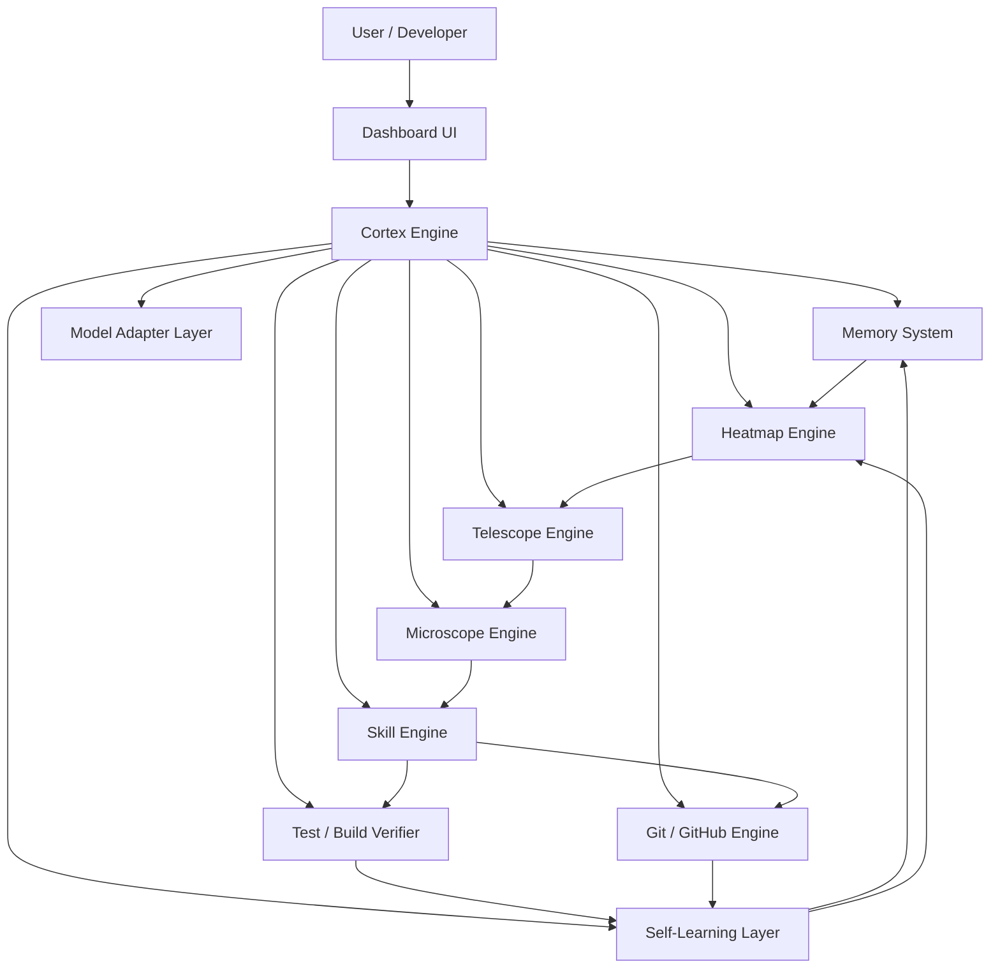

---

# 2. Core Cognitive Loop

```mermaid
flowchart LR
    Task[Task Received]
    LoadMemory[Load Memory]
    Heat[Calculate Heatmap]
    Telescope[Route Attention / Telescope]
    Microscope[Inspect Deeply / Microscope]
    Context[Build Context Pack]
    Skill[Run Skill]
    Patch[Apply Patch]
    Verify[Run Tests / Build]
    Reflect[Reflection]
    Replay[Context Replay]
    UpdateMemory[Update Memory]

    Task --> LoadMemory
    LoadMemory --> Heat
    Heat --> Telescope
    Telescope --> Microscope
    Microscope --> Context
    Context --> Skill
    Skill --> Patch
    Patch --> Verify
    Verify --> Reflect
    Reflect --> Replay
    Replay --> UpdateMemory
    UpdateMemory --> LoadMemory
```

---

# 3. Repository Understanding Pipeline

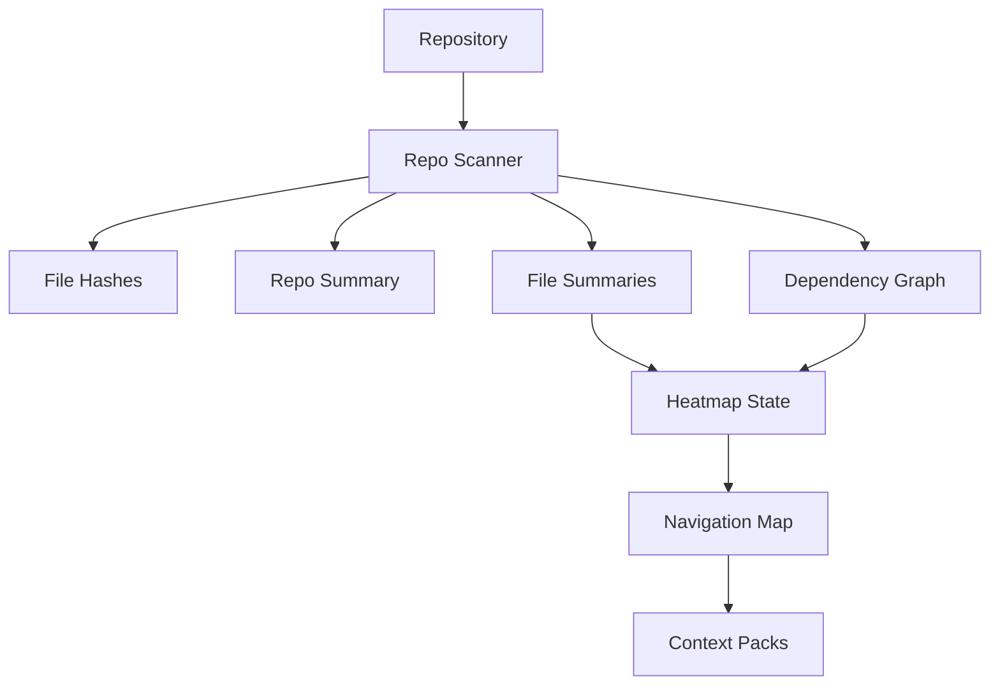

---

# 4. Memory Infrastructure

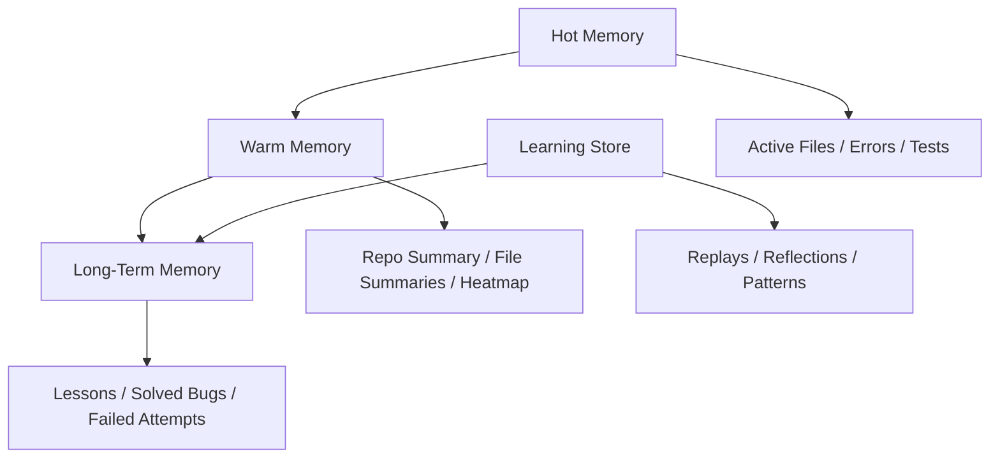

Expected structure:

```text
.ownai/
├── memory/
│   ├── hot/
│   ├── warm/
│   └── long_term/
├── cache/
└── learning/
```

---

# 5. Attention / Heatmap Flow

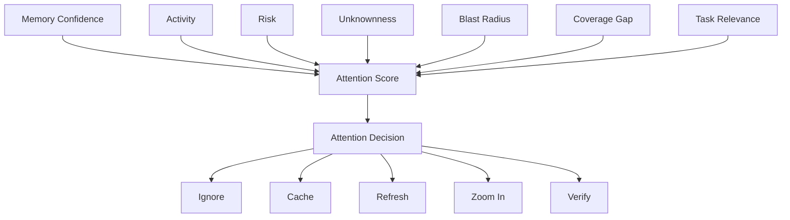

---

# 6. Telescope and Microscope Relationship

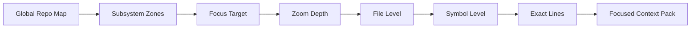

Rule:

```text
Telescope decides where and how deep.
Microscope performs the deep inspection.
```

---

# 7. Skill Execution Flow

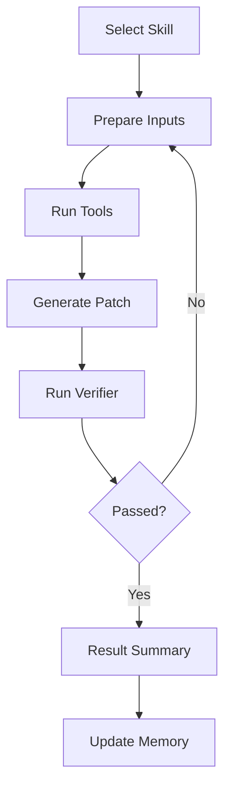

---

# 8. Self-Learning Layer

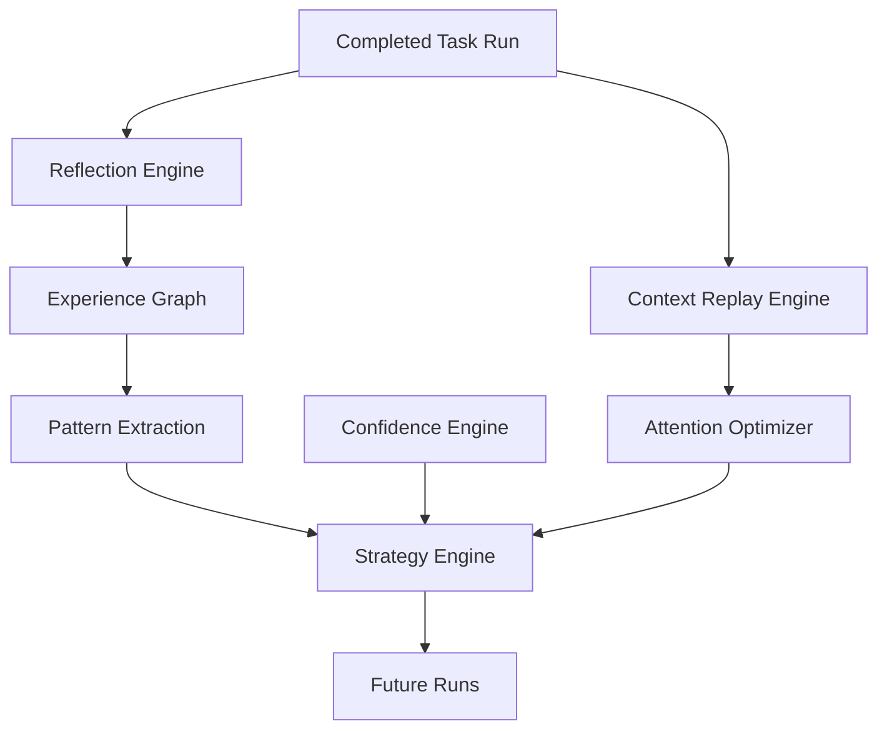

---

# 9. Git-Safe Autonomy Flow

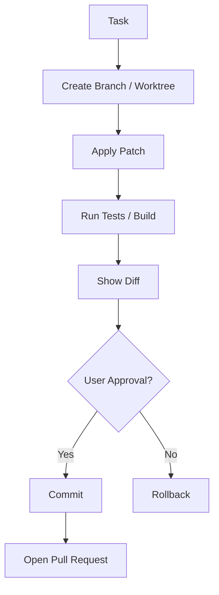

---

# 10. Package Infrastructure

```mermaid
flowchart TD
    Apps[apps]
    Packages[packages]
    Docs[docs]

    Dashboard[apps/dashboard]

    AgentCore[packages/agent-core]
    RepoScanner[packages/repo-scanner]
    Memory[packages/memory-system]
    Heatmap[packages/heatmap-engine]
    Telescope[packages/telescope-engine]
    Microscope[packages/microscope-engine]
    Skills[packages/skill-engine]
    Git[packages/git-engine]
    Verifier[packages/verifier]
    Models[packages/model-adapters]
    Learning[packages/learning]
    UI[packages/ui]

    Apps --> Dashboard
    Packages --> AgentCore
    Packages --> RepoScanner
    Packages --> Memory
    Packages --> Heatmap
    Packages --> Telescope
    Packages --> Microscope
    Packages --> Skills
    Packages --> Git
    Packages --> Verifier
    Packages --> Models
    Packages --> Learning
    Packages --> UI
```

---

# 11. Implementation Order

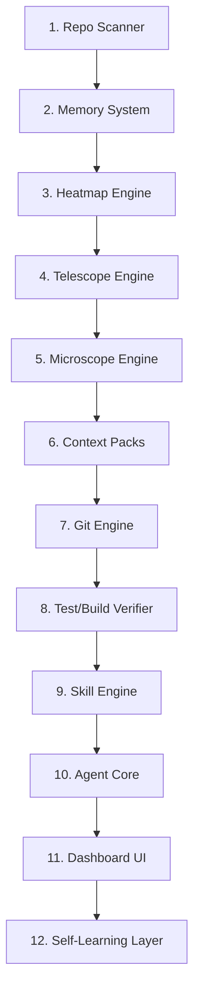

---

# Final Infrastructure Rule

```text
Every module should be independently understandable, testable, replaceable, and improvable by OwnAI itself.
```
